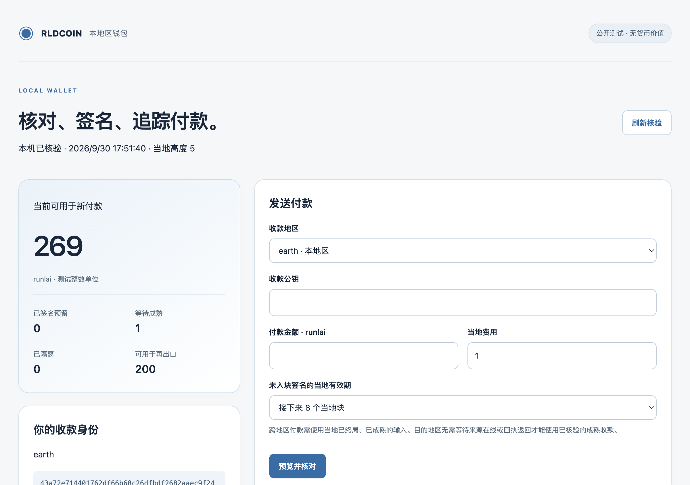

# Native regional candidate: local wallet interface

A loopback browser wallet now presents exact native review, explicit signing,
input reservations, retained signature recovery/download, optionally configured
local inclusion, group approval-file combination and independent recipient
checks. It uses the existing native ledger and wallet journal. Ordinary full-node
startup continues to own its default relay; this wallet-only client does not
create an always-online directory or infer that distant nodes are reachable.
**Public fixture keys, no monetary value, no adopted-network upgrade.**

Before signing, the user reviews exact input owners/amounts, recipients, local
refunds, fees, currency, regions and expiry, then checks a confirmation box.
The client records that clicked operation first. Native signing persists the
approval and only that owner's input reservations before returning it; the
client persists a separately retained latest head before releasing its response.
Restart recovers an exact existing approval without a key. Native `--recover-only`
cannot first-sign, even with a valid key. An unchanged old native head permits
clearing an unsigned interrupted review and requiring new explicit consent.
Persistence ambiguity stops signing and retains the operation.

Local and onward available budgets exclude signed reservations. Quarantine,
recognized local export checkpoint, destination pending/import/maturity/spent
states and source-side unknown remote state stay separate. Historical contact
reports never prove current liveness, reachability or payment authority.
Timeout, session expiry, missing receipt and inclusion never refund exports.
Private key files are native inputs; the browser does not upload or read them.

The HTTP client binds only 127.0.0.1, validates exact Host/Origin and an ephemeral
capability, removes the startup URL fragment, rejects ambiguous framing and
bounds requests/responses and socket input. It serves no external scripts and
uses CSP, no-store and no-referrer. These local controls do not establish an
independent security review, protection against malicious same-user software,
cross-device custody or a qualified external rollback anchor.

## Actual verification

All 63 native tests, strict all-target static checks, 20 native process/HTTP
integrations (8 relay, 5 wallet CLI, 7 wallet app) and 59 transport tests pass.
A fresh 214-file source extraction reproduces the same test results and every
field of the actual group payment report; the TLS contact campaign differs only
in permitted busy-retry/helper counts and retains all 31 conservation checks.
All 167 base-source hashes remain unchanged.

The [actual browser checks](browser-checks.json) record initialization, complete
review, explicit signing and local inclusion. The signed input reserves 100,
leaving 100 available and 100 eligible for onward payment. Local inclusion sends
30 to the intended fixture owner, releases the reservation, leaves 269 currently
available and 200 available for onward export. Native total issuance/liquid
value remains 300. Desktop (1200 px) and mobile (390 px) layouts were visually
inspected without horizontal overflow.



The [group payment report](payment-report.json) independently retains inputs
39 and 60 from two owner wallets, requires both approvals, and leaves 95 mature
net units after a gross remote export of 97 and destination fee 2. Missing,
duplicate or partial approvals cannot enter a native block. This is same-host,
same-controller fixture operation. The [TLS contact campaign](campaign-report.json)
still covers three separate native processes, two-hop delivery, Earth-offline
remote payment/onward export and a new cyclic return with no reversal of the
original debit.

## Reproduce

Verify SHA256SUMS and extract source.tar.gz into a new directory. Use Rust 1.98
or later and Python 3.11 or later with the pinned TLS dependencies:

```sh
cargo test --locked --manifest-path tools/regional-ledger/Cargo.toml
cargo clippy --locked --manifest-path tools/regional-ledger/Cargo.toml --all-targets -- -D warnings
cargo build --locked --manifest-path tools/regional-ledger/Cargo.toml --bins
python3 -m pip install -r tools/interstellar-mesh-requirements.txt
RLD_GROUP_WALLET_REPORT=/absolute/NEW-group-report.json python3 -m unittest discover -s tools -p 'test_regional_*.py' -v
python3 -m unittest discover -s tools -p 'test_interstellar_*.py' -v
python3 tools/regional_contact_campaign.py --binary "$PWD/tools/regional-ledger/target/debug/rld-regional-ledger-candidate" --root /absolute/NEW-fixture --report /absolute/NEW-contact-report.json --adapter tcp
```

See the [wallet/startup guide](tools/regional-ledger/README.md),
[ledger rules](docs/research/REGIONAL_LEDGER_CANDIDATE_V1.md),
[verification](verification.json) and [current status](PLAN_STATUS.zh-CN.md).
The archive contains only named source/fixture vectors. Private mesh identities,
contact configuration, keys, wallet/session/signer journals and node state are
excluded. Earlier signed commitments and historical releases remain intact.

## Mandatory qualification still open

Encrypted key creation/backup, hardware custody, an interactive group proposal
builder and complete wallet product experience remain required. Cross-device
cooperation, recovery under reorganization and independent anti-rollback/security
qualification remain open. So do BFT, payment channels, long-term archives and
cryptography, independent operators/review/custody, actual release adoption,
cross-host/physical adapters and sustained resource budgets. No complete I1-I12
qualification, mainnet authorization or actual stellar payment route is claimed.
